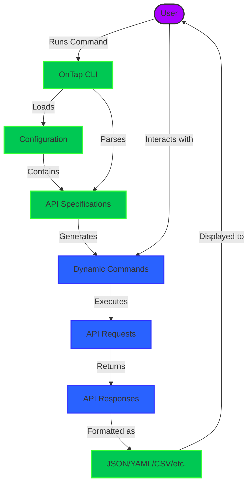

# OnTap CLI

OnTap (`ontap`) is a dynamic CLI generator that creates command-line interfaces from OpenAPI specifications at runtime. It enables instant CLI interaction with any API that has an OpenAPI spec without requiring custom code generation, compilation, or modification.

[](https://opensource.org/licenses/MIT)

## Prerequisites

### Required Tools

- [mise](https://mise.jdx.dev) - The recommended tool for managing dependencies and running tasks
  - Automatically manages Go, GoReleaser, and other dependencies
  - Provides task automation for building, testing, and releasing

### Installing mise

```bash
# Install mise
curl https://mise.run | sh

# Add mise to your shell
echo 'eval "$(~/.local/bin/mise activate bash)"' >> ~/.bashrc  # For bash
echo 'eval "$(~/.local/bin/mise activate zsh)"' >> ~/.zshrc    # For zsh
```

After installing mise, it will automatically install all required dependencies when you run any mise task in the project directory.

## How It Works

OnTap dynamically generates CLI commands based on OpenAPI specifications:

1. **Runtime Generation**: Commands are created on-the-fly when you run the CLI, not pre-generated as source code
2. **No Code Generation**: Unlike SDK generators, OnTap doesn't produce code that you need to build or modify
3. **Direct API Interaction**: The CLI directly interprets the OpenAPI spec and translates it into commands

This approach allows you to immediately interact with any API by simply pointing OnTap to its OpenAPI specification.

## Features

- **Dynamic Command Generation**: Automatically generates CLI commands from OpenAPI specs at runtime
- **Multiple API Support**: Manage multiple APIs in a single CLI
- **Authentication**: Support for Basic Auth, API Key, and Bearer Token
- **Request/Response Handling**: Support for query parameters, headers, request body, and response formatting
- **Output Formatting**: JSON, YAML, CSV, text, and table output formats
- **Caching**: Cache OpenAPI specs for faster startup
- **Dry Run**: Test commands without making actual API calls

## Installation

### Using Package Managers

OnTap is distributed through various package managers for easy installation:

```bash
# Homebrew (macOS and Linux)
brew install fynxlabs/brew-tap/ontap

# Debian/Ubuntu
curl -L https://github.com/fynxlabs/ontap/releases/latest/download/ontap_Linux_x86_64.deb -o ontap.deb
sudo dpkg -i ontap.deb

# RPM-based (Fedora, RHEL, etc.)
curl -L https://github.com/fynxlabs/ontap/releases/latest/download/ontap_Linux_x86_64.rpm -o ontap.rpm
sudo rpm -i ontap.rpm

# Alpine Linux
curl -L https://github.com/fynxlabs/ontap/releases/latest/download/ontap_Linux_x86_64.apk -o ontap.apk
sudo apk add --allow-untrusted ontap.apk

# Arch Linux
curl -L https://github.com/fynxlabs/ontap/releases/latest/download/ontap_Linux_x86_64.pkg.tar.zst -o ontap.pkg.tar.zst
sudo pacman -U ontap.pkg.tar.zst
```

### Direct Download

You can download pre-built binaries for your platform from the [releases page](https://github.com/fynxlabs/ontap/releases).

### Building from Source

```bash
# Clone the repository
git clone https://github.com/fynxlabs/ontap.git
cd ontap

# Using mise (recommended)
mise run build

# Or using Go directly
go build -o ontap

# Install the CLI (optional)
sudo mv ontap /usr/local/bin/
```

## Quick Start

1. Initialize a configuration file:

    ```bash
    ontap init
    ```

2. Edit the configuration file to add your API specs:

    ```yaml
    apis:
      my-api:
        apispec: ./test/fixtures/openapi.yaml
        auth: user:pass
        url: http://api.example.com
    ```

3. Use the CLI:

    ```bash
    # List available commands
    ontap --help

    # List API commands
    ontap my-api --help

    # Execute an API command
    ontap my-api users list
    ```

## Configuration

OnTap uses a YAML configuration file to manage API specs. The default location is platform-specific:
- macOS: `~/Library/Application Support/ontap/config.yaml`
- Linux: `~/.config/ontap/config.yaml` (XDG style)
- Windows: `%APPDATA%\ontap\config.yaml`

You can specify a different location with the `--config` flag.

Example configuration:

```yaml
apis:
  my-api:
    apispec: ./test/fixtures/openapi.yaml
    auth: user:pass
    url: http://api.example.com
    cache_ttl: 24h
    output: json
    headers:
      User-Agent: OnTap CLI
```

### Configuration Options

- `apispec`: Path to the OpenAPI spec file (local file or URL)
- `auth`: Authentication credentials (username:password, Bearer token, or API key)
- `url`: Base URL for the API
- `cache_ttl`: Cache time-to-live for the OpenAPI spec (default: 24h)
- `output`: Default output format (json, yaml, csv, text, table)
- `headers`: Default headers to include in all requests

## Usage

### Global Flags

- `-c, --config`: Config file path
- `-o, --output`: Output format (json, yaml, csv, text, table)
- `-l, --log-level`: Log level (debug, info, warn, error)
- `-v, --verbose`: Verbose output
- `--dry-run`: Dry run (don't execute requests)
- `--save`: Save response to file
- `--extract`: Extract fields from response (comma-separated)
- `--filter`: Filter response using JQ-like syntax

### Request Flags

- `-d, --data`: Request body data (JSON string or @file)
- `-H, --header`: Request header (key:value)
- `-q, --query`: Query parameter (key=value)
- `-F, --form`: Form data (key=value or key=@file)
- `-a, --auth`: Authentication (username:password, Bearer token, or API key)
- `-t, --content-type`: Content type

### Examples

```bash
# List users
ontap my-api users list

# Get a user
ontap my-api users get 123

# Create a user
ontap my-api users create --data='{"name":"John Doe","email":"john@example.com"}'

# Create a user from a file
ontap my-api users create --data=@user.json

# Update a user
ontap my-api users update 123 --data='{"name":"John Doe","email":"john@example.com"}'

# Delete a user
ontap my-api users delete 123

# Add query parameters
ontap my-api users list --query="limit=10" --query="offset=0"

# Add headers
ontap my-api users list --header="X-API-Key:abc123"

# Change output format
ontap my-api users list --output=yaml

# Save response to file
ontap my-api users list --save=users.json

# Extract fields from response
ontap my-api users list --extract="items.*.name"

# Filter response
ontap my-api users list --filter="[?status=='active']"

# Dry run
ontap my-api users create --data='{"name":"John Doe"}' --dry-run
```

## Commands

### `ontap init`

Initialize a new configuration file.

```bash
# Initialize a new configuration in the current directory
ontap init

# Initialize a new configuration in the home directory
ontap init --global

# Overwrite existing configuration
ontap init --force
```

### `ontap refresh`

Refresh the cached OpenAPI specs.

```bash
# Refresh all API specs
ontap refresh

# Refresh a specific API spec
ontap refresh my-api
```

## Quick Demo with Docker Compose

The easiest way to try OnTap is with our Docker Compose demo:

```bash
# Using mise (recommended)
mise run demo-start

# Or manually
cd demo
docker-compose up -d
ontap init --config demo/config.yaml

# Try some commands
ontap demo-noauth list-items
ontap demo-noauth get-item 1
ontap demo-noauth create-item --data '{"name":"Test Item","description":"A test item"}'

# Try with authentication
ontap demo-basic list-items --auth="user:pass"

# Stop the demo
mise run demo-stop  # Using mise
# Or: cd demo && docker-compose down  # Manually
```

The demo includes:

- A simple Items API with CRUD operations
- Two server instances (one with no auth, one with basic auth)
- Pre-configured OpenAPI specifications
- Ready-to-use OnTap configuration

See the [demo README](demo/README.md) for more details.

## Development

### Using mise for Development

OnTap uses [mise](https://mise.jdx.dev) for development tasks. The `mise.toml` file defines all the tools and tasks needed for development.

```bash
# List available tasks
mise tasks ls

# Build the project
mise run build

# Run tests
mise run test

# Create a release
mise run release
```

### GoReleaser

OnTap uses [GoReleaser](https://goreleaser.com) to build and package releases. GoReleaser automates:

- Cross-compilation for multiple platforms (Linux, macOS, Windows)
- Creating distribution packages (deb, rpm, apk, etc.)
- Publishing to package managers (Homebrew, etc.)
- Generating changelogs

The `.goreleaser.yaml` file defines the release configuration.

#### Generated Artifacts

GoReleaser generates the following artifacts:

- Binary executables for multiple platforms
- Debian packages (.deb)
- RPM packages (.rpm)
- Alpine Linux packages (.apk)
- Arch Linux packages (.pkg.tar.zst)
- Homebrew formula
- Checksums and signatures

#### Creating a Release

To create a new release:

1. Tag the commit:

   ```bash
   git tag -a v1.0.0 -m "Release v1.0.0"
   git push origin v1.0.0
   ```

2. Run GoReleaser:

   ```bash
   mise run release
   ```

For testing releases without publishing:

```bash
mise run release-snapshot
```

## How OnTap Works (Under the Hood)

OnTap dynamically generates CLI commands from OpenAPI specificationss at runtime. The following diagrams illustrate how the tool processes API specifications and transforms them into usable CLI commands.

### High-Level Architecture

This diagram shows the main components of OnTap and how they interact:



### OpenAPI Spec Processing

This diagram illustrates how OnTap processes an OpenAPI specification and transforms it into CLI commands:


### Example: Petstore API Transformation

This example shows how a simple Petstore API with three endpoints is transformed into CLI commands:


### Command Execution Flow

When you run an OnTap command, this is what happens behind the scenes:


### From Configuration to CLI Transformation

This diagram shows how your configuration file entries are transformed into a complete CLI command tree:


## Roadmap

The following features and improvements are planned for future releases:

1. **Comprehensive Testing**: Add extensive test coverage for all components
2. **Command Completion**: Add shell completion for commands and parameters
3. **Enhanced Authentication**: Support for more authentication methods
4. **Improved Error Handling**: Better error messages and recovery options
5. **Advanced Response Processing**: Enhanced filtering and extraction capabilities
6. **Improved Documentation**: Add more examples and guides for common use cases
